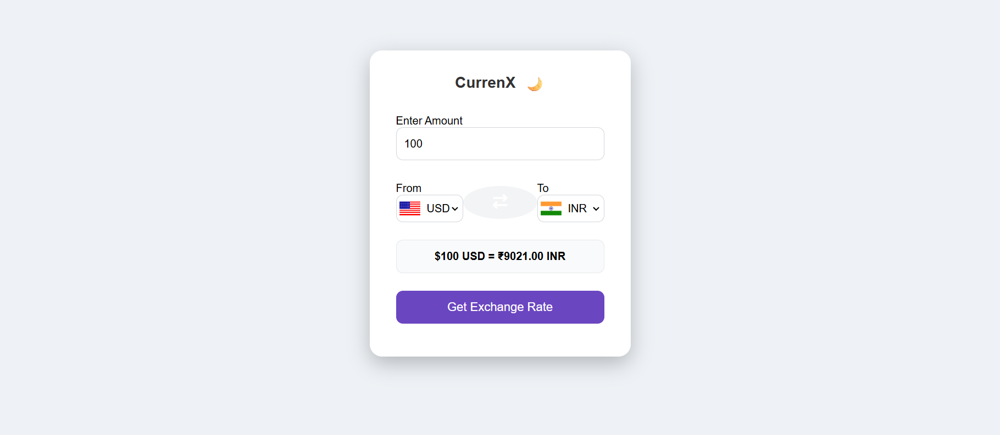

# 🚀 CurrenX — Fintech Currency Converter Web App

CurrenX is a modern and interactive currency converter web application that provides real-time forex exchange rates with a clean fintech-styled interface. Users can convert between global currencies, swap currency pairs instantly, and toggle between dark and light themes.

---

## ✨ Features

- 🔁 **Real-Time Currency Conversion**
- 🇺🇸➡️🇮🇳 **Country Flags for Currency Selection**
- 🔄 **Instant Swap (From ↔ To)**
- 🌙 **Dark/Light Mode with LocalStorage Persistence**
- 💱 **Currency Symbols for Better Readability**
- 📱 **Responsive Layout (Mobile + Desktop)**
- 🎨 **Fintech-Inspired UI/UX**
- 🟦 **Built with Vanilla JS, HTML & CSS**

---

## 🛠 Tech Stack

- **HTML5**
- **CSS3**
- **JavaScript (ES6+)**
- **Exchange Rate API**
- **LocalStorage**

---

## 🔗 Live Demo

👉 https://srushtidumbhare7-ad.github.io/currenx-currency-converter/

---

## 📸 Screenshots

### Light Mode

### Dark Mode

